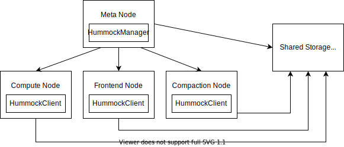

# An Overview of RisingWave State Store

## Overview

In RisingWave, all streaming executors store their data in a state store. This state store is backed by a service called Hummock, which can be considered as a cloud-native LSM-tree based storage engine. Hummock provides KV API, and stores all data on S3-compatible service. However, it is not a key-value store for general purpose, but a storage engine co-designed with RisingWave streaming engine and optimized for streaming workload.

## Architecture
Reading this document requires prior knowledge of LSM-tree based KV storage engine, like RocksDB, LevelDB, etc.



Hummock consists of a manager service on meta node, clients on compute nodes, and a shared storage to store files. Every time a new write batch is produced, `HummockClient` will upload those files to shared storage, and notify the `HummockManager` of the new data. With compaction going on, new files will be added and old files will be vacuumed. The `HummockManager` will take care of the lifecycle of a file — is a file is being used? can we delete a file? etc.

Streaming state store has distinguish workload characteristics.

* Every streaming executor will only read *and write its own portion of data*, which are multiple consecutive non-overlapping ranges of keys (we call it *key space*).
* Data (generally) *won’t be shared across nodes*, so every worker node will only read and write its own data. Therefore, all Hummock API like get, scan only guarantees writes on one node can be immediately read from the same node. In some cases, if we want to read data written from other nodes, we will need to *wait for the epoch*.
* Streaming data are *committed in serial*. Based on the [barrier-based checkpoint algorithm](https://en.wikipedia.org/wiki/Chandy%E2%80%93Lamport_algorithm), the states are persisted epoch by epoch. We can tailor the write path specifically for the epoch-based checkpoint workload.

This leads to the design of Hummock, the cloud-native KV-based streaming state store. We’ll explain concepts like “epoch”, “key space” and “barrier” in the following chapters.

## The Hummock User API
The Hummock itself provides 3 simple APIs: `write_batch`, `get`, and `scan`. Hummock provides MVCC write and read on KV pairs. Every key stored in Hummock has an *epoch* (aka. timestamp). Developers should specify an epoch when calling Hummock APIs.

Hummock doesn’t support writing a single key. To write data into Hummock, users should provide a *sorted, unique* list of *keys* and the corresponding *operations* (put value, delete), with an *epoch*, and call the `write_batch` API. Therefore, within one epoch, users can only have one operation for a key. For example,

```
[a => put 1, b => put 2] epoch = 1 is a valid write batch
[a => put 1, a => delete, b => put 2] epoch = 1 is an invalid write batch
[b => put 1, a => put 2] epoch = 1 is an invalid write batch
```

For reads, we can call `scan` and `get` API on Hummock client. Developers need to specify a read epoch for read APIs. Hummock only guarantees writes on one node can be immediately read from the same node. Let’s take a look at the following example:

```
Node 1: write a => 1, b => 2 at epoch 1
Node 1: write a => 3, b => 4 at epoch 2
Node 2: write c => 5, d => 6 at epoch 2
```

After all operations have been done,

```
Read at epoch 2 on Node 1: a => 3, b => 4, (c => 5, d => 6 may be read)
Read at epoch 1 on Node 1: a => 1, b => 2
Read at epoch 2 on Node 2 with `wait_epoch 2`: a => 3, b => 4, c => 5, d => 6
```

To synchronize data between Hummock manager and clients, there are also a lot of internal APIs. We will discuss them later along with the checkpoint process.
