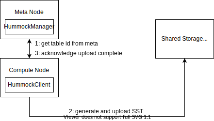
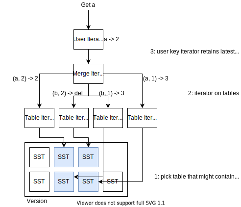
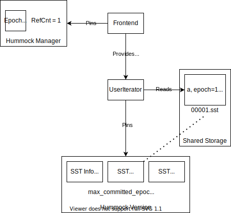

# An Overview of RisingWave State Store

## Overview

In RisingWave, all streaming executors store their data in a state store. This state store is backed by a service called Hummock, which can be considered as a cloud-native LSM-tree based storage engine. Hummock provides KV API, and stores all data on S3-compatible service. However, it is not a key-value store for general purpose, but a storage engine co-designed with RisingWave streaming engine and optimized for streaming workload.

## Architecture
Reading this document requires prior knowledge of LSM-tree based KV storage engine, like RocksDB, LevelDB, etc.


Hummock consists of a manager service on meta node, clients on compute nodes, and a shared storage to store files. Every time a new write batch is produced, Hummock client will upload those files to shared storage, and notify the Hummock manager of the new data. With compaction going on, new files will be added and old files will be vacuumed. The Hummock manager will take care of the lifecycle of a file — is a file is being used? can we delete a file? etc.

Streaming state store has distinguished workload characteristics.

* Every streaming executor will only ***read and write its own portion of data***, which are multiple consecutive non-overlapping ranges of keys (we call it ***key space***).
* Data (generally) ***won’t be shared across nodes***, so every worker node will only read and write its own data. Therefore, all Hummock API like get, scan only guarantees writes on one node can be immediately read from the same node. In some cases, if we want to read data written from other nodes, we will need to *wait for the epoch*.
* Streaming data are ***committed in serial***. Based on the [barrier-based checkpoint algorithm](https://en.wikipedia.org/wiki/Chandy%E2%80%93Lamport_algorithm), the states are persisted epoch by epoch. We can tailor the write path specifically for the epoch-based checkpoint workload.

This leads to the design of Hummock, the cloud-native KV-based streaming state store. We’ll explain concepts like “epoch”, “key space” and “barrier” in the following chapters.

## The Hummock User API
The Hummock itself provides 3 simple APIs: `write_batch`, `get`, and `scan`. Hummock provides MVCC write and read on KV pairs. Every key stored in Hummock has an *epoch* (aka. timestamp). Developers should specify an epoch when calling Hummock APIs.

Hummock doesn’t support writing a single key. To write data into Hummock, users should provide a ***sorted, unique*** list of ***keys*** and the corresponding ***operations*** (put value, delete), with an ***epoch***, and call the `write_batch` API. Therefore, within one epoch, users can only have one operation for a key. For example,

```
[a => put 1, b => put 2] epoch = 1 is a valid write batch
[a => put 1, a => delete, b => put 2] epoch = 1 is an invalid write batch
[b => put 1, a => put 2] epoch = 1 is an invalid write batch
```

For reads, we can call `scan` and `get` API on Hummock client. Developers need to specify a read epoch for read APIs. Hummock only guarantees writes on one node can be immediately read from the same node. Let’s take a look at the following example:

```
Node 1: write a => 1, b => 2 at epoch 1
Node 1: write a => 3, b => 4 at epoch 2
Node 2: write c => 5, d => 6 at epoch 2
```

After all operations have been done,

```
Read at epoch 2 on Node 1: a => 3, b => 4, (c => 5, d => 6 may be read)
Read at epoch 1 on Node 1: a => 1, b => 2
Read at epoch 2 on Node 2 with `wait_epoch 2`: a => 3, b => 4, c => 5, d => 6
```

## Hummock Internals

In this part, we will discuss how data are stored and organized in Hummock internally. If you will develop Hummock, you should learn some basic concepts, like SST, key encoding, read / write path, consistency, from the following sections.

### Storage Format

All key-value paris are stored in block-based SSTables. Each user key is associated with an epoch. In SSTs, key-value pairs are sorted first by user key (lexicographical order), and then by epoch (largest to smallest).

For example, if users write two batches in consequence:

```
write a => 1, b => 2 at epoch 1
write a => delete, b => 3 at epoch 2
```

After compaction (w/ min watermark = 0), there will eventually be an SST with the following content:

```
(a, 2) => delete
(a, 1) => 1
(b, 2) => 3
(b, 1) => 2
```

### Write Path
Hummock client will batch writes and generate SSTs to sync to the underlying S3-compatiable service. The SST consists of two files: <id>.data and <id>.meta. The data file is composed of ~64KB blocks, where each block contains actual key value pairs; while the meta file contains large metadata like bloom filter. After the SST is uploaded to S3, Hummock client will let the Hummock manager know there’s a new table.




The list of all SSTs along with some metadata forms a ***version***. When Hummock client adds new SSTs to the Hummock manager, a new version will be generated with the new set of SST files.

### Read Path
To read from Hummock, we will first need a ***version*** (a consistent state of list of SSTs we can read). To avoid contacting Hummock manager in every user read, the Hummock client will cache a most recent ***version*** locally. Local version will be updated when 1) client initiates a write batch and 2) backgroud refresher triggers.

For every read operation (scan, get), we will first select SSTs that might contain a key.

For scan, we simply select by overlapping key range. For point get, we will filter SSTs further by bloom filter. After that, we will compose a single `MergeIterator` over all SSTs. The `MergeIterator` will return all keys in range along with their epoch. Then, we will create `UserIterator` over `MergeIterator`, and for all user keys, the user iterator will pick the first full key that have epoch <= read epoch. Therefore, users can perform snapshot read from Hummock based on the given epoch. The snapshot should be acquired beforehand and released afterwards.




### Compaction
Currently, Hummock is using a compaction strategy similar to leveled-compaction in RocksDB. In the future, we will migrate to a compaction scheme that can “understand” how data are distributed in streaming executors for better data locality.

To support MVCC read without affecting compaction, we track the epoch low watermark in Hummock snapshots. A user key-value pair will be retained if (1) it is the latest, or (2) it belongs to an epoch above the low watermark.


## Hummock Manager
In this part, we will discuss how Hummock coordinates among multiple compute nodes. We will introduce concepts like “snapshot”, “version”, and give examples on how Hummock manages them.

Every operation on the LSM tree yields a new ***version*** on Hummock manager, e.g., add new L0 SSTs, compaction. In streaming, each stream barrier is associated with an ***epoch***. When the barrier flows across the system and collected by the stream manager, we can start doing ***checkpoint*** on an epoch. SSTs produced in a single checkpoint are associated with an ***uncommitted epoch***. After all worker nodes complete adding L0 tables to Hummock, the epoch will be considered committed. Therefore, apart from the list of files in LSM, a version also contains committed epoch number max_committed_epoch and SSTs in uncommitted epochs. Therefore, ***operations on LSM*** and ***streaming checkpoint*** will both yield new version in Hummock manager.

Currently, there will be only one checkpoint happening in the system at the same time. In the future, we will support more checkpoint optimizations including concurrent checkpoint.

As mentioned in [Read Path](#read-path), reads are performed on a ***version*** based on a given ***epoch***. During the whole read process, data from the specified read epoch should not be removed by compaction, which is guaranteed by ***pinning an epoch*** (aka. ***pinning a snapshot***), and SSTs within a ***version*** should not be vacuumed by compaction, which is guaranteed by ***pinning a version***

The SQL frontend will get the latest epoch from meta service. Then, it will embed the epoch number into SQL plans, so that all compute nodes will read from that epoch. In theory, both SQL frontend and compute nodes will *pin the snapshot*, to handle the case that frontend goes down and the compute nodes are still reading from Hummock (#622). However, to simplify the process, currently we *only pin on the frontend side**.*




Hummock only guarantees that writes on one node can be immediately read from the same node. However, the worker nodes running batch queries might have a slightly outdated version with a batch query plan is received (due to the local version caching). Therefore, we have a `wait_epoch` interface to wait until the local cached version contains full data of one epoch.

When there is no reference to a version, all file deletions in this version can be actually applied. There is a background vacuum task dealing with the actual deletion.

## 